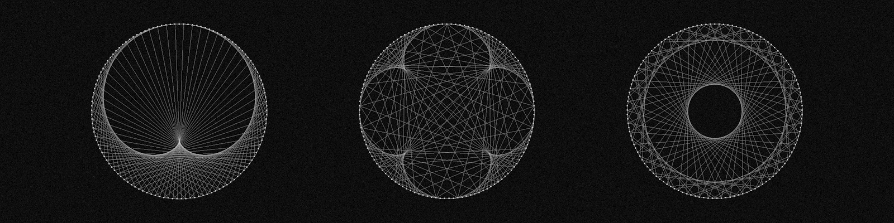

# Modular Cardioid

A real-time visualization of modular multiplication on a circle. The application distributes points around a centered circle and connects every point `i` to `(multiplier × i) mod points`. A multiplier of `2` produces the familiar cardioid, while other values reveal different geometric patterns.

## Install and run on Windows

1. Download the ZIP from the latest release and extract all its files into one folder.
2. Open the extracted folder and run `modular-cardioid.exe`.

## Build from source

You need Git, a C++17-compatible compiler, CMake 3.21 or later, Ninja, and SDL2. Dear ImGui 1.92.9 is downloaded automatically by CMake during the first configuration.

### Install build tools on Windows (MSYS2 UCRT64)

From an MSYS2 UCRT64 terminal:

```bash
pacman -S --needed git mingw-w64-ucrt-x86_64-toolchain mingw-w64-ucrt-x86_64-cmake mingw-w64-ucrt-x86_64-ninja mingw-w64-ucrt-x86_64-SDL2
```

### Install build tools on Debian or Ubuntu

```bash
sudo apt update
sudo apt install git build-essential cmake ninja-build libsdl2-dev
```

### Compile the application

Create an optimized build from the repository root:

```bash
cmake --preset release
cmake --build --preset release
```

### Run the local build

```bash
./build/release/modular-cardioid
```

On Windows, use `./build/release/modular-cardioid.exe`.

## Develop with Visual Studio Code

Install the Microsoft **C/C++** and **CMake Tools** extensions. On Windows, open the repository from an MSYS2 UCRT64 terminal:

```bash
cd /c/path/to/modular-cardioid
code .
```

To debug, open the command palette, run **CMake: Select Configure Preset**, select **Debug**, add a breakpoint, and start **CMake: Debug**.

Make sure the CMake Tools output references `C:\msys64\ucrt64` instead of `C:\mingw64`.
